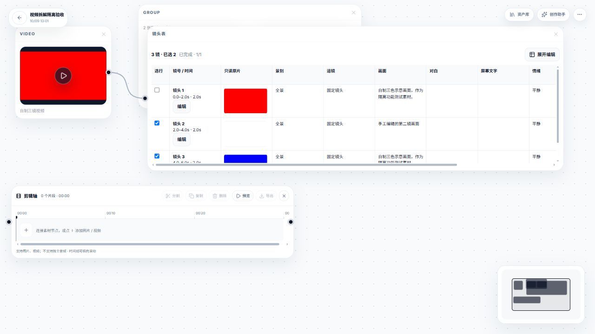

# 普通与智能画布视频拆解：实现与验收记录

2026-10-09。本地源码已接入真实普通画布和智能画布入口；日常服务3000已重启，新接口返回200。两种画布均完成隔离环境的自动检查和实际界面验收，等待用户确认后提交、上传。

## 使用

刷新普通或智能画布，对画布视频或输出视频进入“编辑”→“拆解视频”：

- 按镜头拆：本地检测、调灵敏度、选帧、加入画布；图片在原视频右侧四列排列，并组成包含全部成功图片的组。普通画布和智能画布都支持。
- 拆成镜头表：检测后手动选择本项目配置的视觉模型，确认整批调用；完成后展开编辑，支持六内置列、自定义列、对白重试、单镜重试和生成所选。
- 本地语音组件首次需要在面板手动安装；日常数据目录尚未安装，不自动下载。云端转写需在原生API设置配置音频模型及支持时间戳的模型ID。

完整来源、默认值及37项要求见 [设计规格](superpowers/specs/2026-10-09-canvas-video-deconstruction-design.md)。参考Nomi提交66d6eafed07ad6239acd765dd05c9eb0870cf849，许可证AGPL-3.0-only；本次按行为规格编写原生适配，没有搬入其React/Electron源码或样式。开放语音组件的版本、下载大小、校验和许可写在 `backend/canvas_video_speech_assets.json`。

## 关键文件

|范围|文件与职责|
|---|---|
|媒体|`backend/canvas_video_media.py`：真实PTS检测、联系表、抽帧、音轨、取消与安全路径|
|编排|`backend/canvas_video_deconstruction.py`：任务保存、确认授权、并发视觉、独立语音、单镜重试|
|语音|`backend/canvas_video_speech.py`及assets JSON：官方组件按需安装、本地分段转写、云端时间戳协议|
|画布|`static/js/canvas-video-deconstruction-{model,host,ui}.js`及CSS：表数据、节点、编辑、落图、原生生成映射；智能画布桥接在 `smart-canvas.js`|
|入口|`main.py`、`canvas.js`、`smart-canvas.js`、两份画布 HTML、`canvas-depth-capture.js`：注入原生媒体/模型/保存/撤销/编辑入口|
|配置|`api-settings.html`、`api-settings.js`：音频模型和时间戳支持列表，保留旧配置|

本次是新增功能，没有旧拆解功能需要删除。原视频预览、深度动作捕捉、剪辑节点均继续使用原实现。未增加第二套素材库、模型配置或外来设计系统；智能画布使用专用镜头表节点和原生图片节点链。

## 智能画布实际验收

隔离端口 `63725` 使用自制三镜视频完成了视频编辑入口、拆解菜单、本地检测、手动选择 `qa-vision`、整批分析和无音轨提示。智能画布生成 `smart-shot-table` 节点后，三镜均可选中、编辑并保存；第一镜改为“智能画布手工编辑保留”，关闭面板并刷新后仍保持。选择三镜生成后创建 3 个智能 Prompt 节点和 3 个智能图片节点，使用隔离 `qa-image` 显示模拟输出，原片帧没有连入生图链。普通画布继续使用原生 `prompt` → `generator` → `output` 链。

## 功能核对与证据

“界面”指隔离真实普通或智能画布的实际操作；视觉/生图使用mock平台，不是模型效果证据。“自动”指实际执行测试通过。

|编号|已接入能力|验证证据与限制|
|---|---|---|
|CUT-01|本地固定0.1检测、进度和错误|界面检测红白蓝自制视频；真实FFmpeg测试损坏/缺工具|
|CUT-02|0.10–0.70、步长0.05，默认0.30|纯模型和实际空选/阈值界面验证|
|CUT-03|弱切点自动放宽、过滤空态|纯模型测试；界面基础已检查|
|CUT-04|源视频2帧去重、界面0.2秒聚簇|算法及模型测试|
|CUT-05|120上限，同分覆盖后半片|200切点测试，不截取前120|
|CUT-06|8列PTS联系表，格高90|真实白/蓝像素映射；旋转显示比例自动检查|
|CUT-07|逐帧、全选/全不选、空选禁用|实际界面操作；身份测试|
|CUT-08|一镜到底均匀3–8帧、避首尾|真实单镜抽帧和纯模型点位测试|
|CUT-09|串行真实JPEG、部分失败、取消|真实抽帧及非法时刻部分失败测试；实际两帧落图|
|CUT-10|右96、四列、间隔32，全部成功图成组|host测试和实际画布截图|
|CUT-11|Esc/关闭/遮罩、提交防误关闭、明确取消|已接入；提交期的全部关闭方式需再做界面复验|
|CUT-12|画布切换、撤销、源身份拒旧结果|A→B→A、同ID重建、权限自动测试|
|TABLE-01|同源表复用、来源连线、多输出身份|host/真实入口测试；实际创建与重开；id/resultId优先级回归|
|TABLE-02|N+1镜、完整首尾、一镜|真实三镜表和模型测试|
|TABLE-03|0.1秒时间量化，时长派生|模型归一化测试|
|TABLE-04|每镜三帧8%/50%/92%，一次请求|manager与真实抽帧测试，mock请求检查|
|TABLE-05|并发4、temperature .2/max_tokens4000|并发、实际上游请求体mock测试；旧请求参数兼容|
|TABLE-06|完整视觉字段、自定义列hint/schema|manager解析和实际增加列；mock分析|
|TABLE-07|围栏/前后说明JSON校验、明确失败|解析测试，不返回假字段|
|TABLE-08|单镜失败、目标重试，保留其他编辑|mock部分失败；实际单镜重试及第二镜编辑保留；新增字段所有权回归|
|TABLE-09|16k单声道64kbps MP3、50分钟/25MB限制|媒体实现；取消半成品→重试缓存回归；无音轨测试|
|TABLE-10|独立本地/配置云端音频模型|配置兼容测试；云端verbose_json模拟协议测试，无真实云端调用|
|TABLE-11|按需安装多语言whisper.cpp、VAD、auto、无上下文|官方固定组件真实下载/校验/健康；真实英文语音与静音|
|TABLE-12|300秒+30秒尾巴，每段失败重试一次|660秒分段/跨段整句/静音推进自动测试；安装MB真实进度|
|TABLE-13|显式云端重试，不自动收费回退|本地失败/云端配置校验自动测试；按钮接入，真实云端质量未测|
|TABLE-14|起点归镜、跨镜承接、整句|模型对白边界测试；本地真实segments时间戳|
|TABLE-15|语音独立失败、无音轨/静音明确状态|speech/manager测试；无音轨实际表|
|TABLE-16|整批报价、一次性/过期/配置变更/源变化授权|实际mock整批确认；重放/跨用户/过期/源变化/预算测试|
|TABLE-17|六列、量测、只读原图、提示词、状态|实际三镜表；字段与XSS自动检查|
|TABLE-18|桌面双击/手机卡片编辑，自定义列增改删|实际添加、改名、手机选镜；删除改为画布内二次确认，该最终确认待界面复验|
|TABLE-19|选行/修订/状态保存，复制不继承授权|实际保存重开；复制重映射、输出归属、独立表、持久编辑基线自动测试；JSON导入导出和Alt复制已实际完成，Ctrl+C/V人工操作受浏览器虚拟剪贴板限制未宣称通过|
|TABLE-20|full/compact/card、横滚、390px卡片|实际390×844，底部可见，无页面横溢；三档缩放已实际切换并恢复|
|TABLE-21|取消/恢复/中断收敛，拒迟到写回|manager重启、取消未发请求、host重开持久基线自动测试|
|TABLE-22|ready只聚焦；重拆显式确认|实际重开不重拆；重拆和删除均使用画布内二次确认|
|TABLE-23|生成所选→原生prompt/gen/output、映射去重|真实模块自动检查；隔离原生图片任务接口成功；普通画布已实际生成、重复生成和结果显示，手工提示词保留|
|TABLE-24|原片帧只读、不给生图默认输入|host及真实连接规则测试，生成链无源图连接|
|TABLE-25|coverage持久传递，未知不假称完整|模型/host/manager覆盖信息检查|

## 实测与限制

最终检查：前端316/316，视频Python64/64，新增模块及共享入口语法/编译通过。完整前端回归包含原剪辑、深度相关检查；范围内Git差异检查无空白错误。

- 隔离测试在临时目录，mock仅在验收helper里，没有进入产品；未读取或覆写原始素材，未调用付费模型。
- 正式服务新模型目录、安装状态和画布页面均返回200；启动完成。正式本地语音组件未安装。
- 官方本地组件合计578,758,725字节，安装在隔离目录。约5秒自制英文语音返回整句及0.1–4.77秒时间戳；静音返回空segments。本机CPU约154秒处理，不能宣称参考机器的速度或中文识别质量已经验证。
- 云端音频协议使用mock检查；视觉分析和生图质量、费用、具体供应商兼容性未进行真实调用。
- 浏览器早期的系统确认框曾导致标签页失去响应；本功能已改用画布内确认，后续普通画布验收已恢复。Ctrl+C/V人工快捷键受浏览器虚拟剪贴板限制，未把尝试当作通过；Alt复制与JSON导入导出已有实际证据。
- 浅色、深色、手机、三档缩放、普通画布生图和智能画布镜头表/生成链操作已完成；截图见下。智能画布沿用其现有主题变量、节点外壳和原生图片节点样式。

## 回退与后续

共享入口的本任务开始前基线保存在忽略的执行账本目录；其他dirty改动已保留。普通画布验收完成后，等待用户确认是否把智能画布也纳入本次范围；确认功能成功后，只提交本功能源码、必要测试及说明，再正常推送个人仓库。
